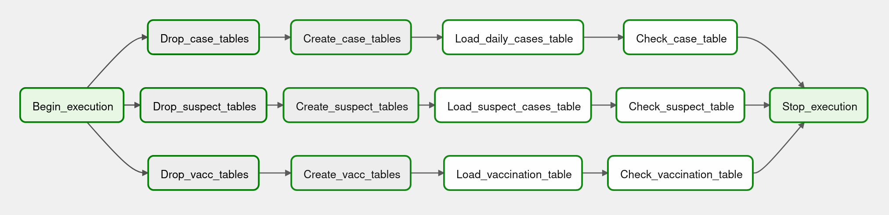
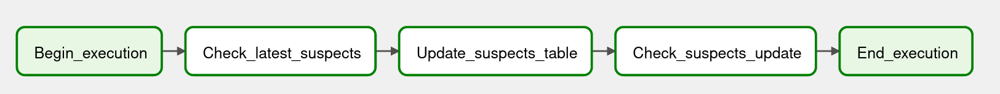
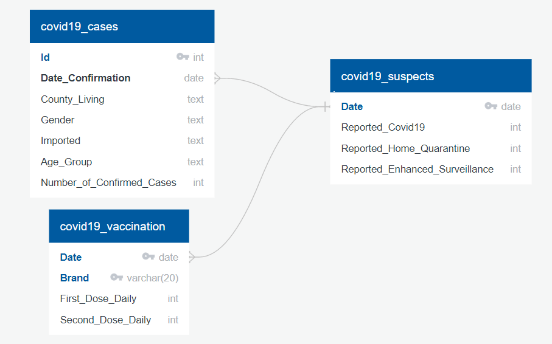
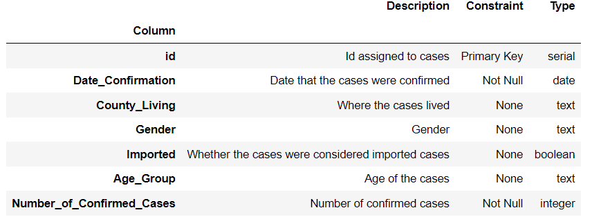
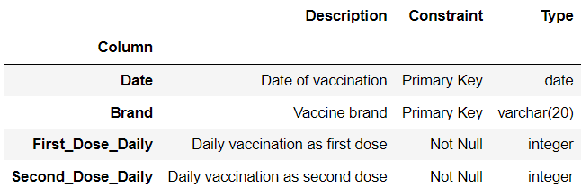
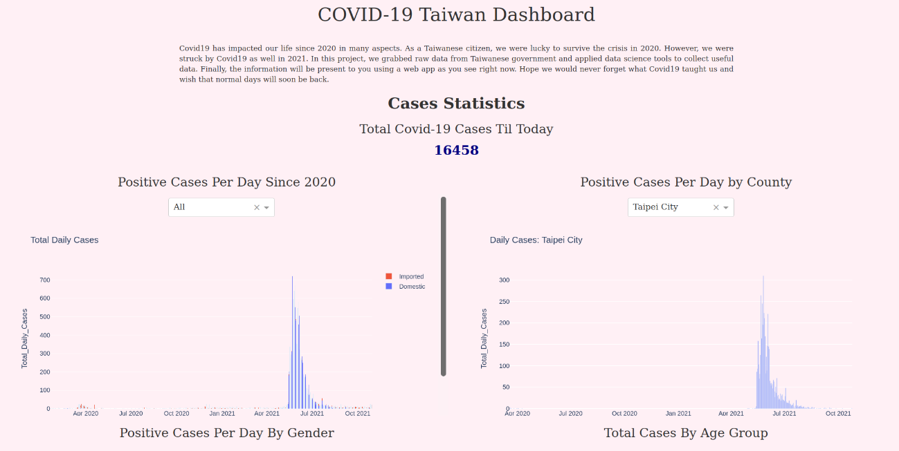

# airflow_covid19_tw

## Motivation
Covid -19 has changed people's life since 2020. For Taiwan, aka my home town, 2021 was especially an year of huge impact by Covid-19. In this project, we would like to collect data from Taiwanese government so that we can present the data in our another applcation and also inspect how the disease impacted on Taiwan. In order to do so, we utilize Apache Airflow which is a well-known software for workflow management as well as MySql, a popular relational databasew management system. We will define dags that has operators inside in to scratch raw data from remote and write into our local database.

## Introduction
This repository contains dags folder and plugins required to complete the project task. You can also move relevant files within the folder to your own airflow folder, and it should also work just fine. Within dags folder, there are dag py files that defines the tasks of initializing database, update and data check. Within operators folder, there are two main sub folder called helpers and operators. Helpers contains helper function that our operator can call. Operators folder contains custom operators that does jobs not available(or intentionally make it new operator) with default operators.

The data of this project will be visualized in web page using Django framework in another project repository, you may check <a href='https://github.com/BurgerWu/Covid19_Django_Webapp'>here</a> for more information.

## Airflow Settings and Run Dags Locally
### Installation of Airflow
- Windows: You may use Windows Subsystem for Linux(Check <a href='https://burgercewu.medium.com/%E5%9C%A8windows-10%E9%9B%BB%E8%85%A6%E4%B8%8A%E4%BD%BF%E7%94%A8windows-subsystem-for-linux%E5%AE%89%E8%A3%9Dapache-airflow-553dc7eca7de'>here</a> or <a href='https://towardsdatascience.com/run-apache-airflow-on-windows-10-without-docker-3c5754bb98b4'>here</a>)  or Docker (Check <a href='https://airflow.apache.org/docs/apache-airflow/stable/start/docker.html'>here</a>)
- Linux : Check <a href='https://airflow.apache.org/docs/apache-airflow/stable/start/local.html'>here</a>
- macOS: Check (<a href='https://insaid.medium.com/setting-up-apache-airflow-in-macos-2b5e86eeaf1'>here</a>)

**You should at least be able to run steps below to start working on Airflow**
- ***airflow db init*** (This initializes database)
- ***airflow users create -u username -f firstname -l lastname -r role -e email -p password*** (This generates Airflow user)
- ***airflow webserver -p portnumber*** (Replace port number to an available port on your machine)
- ***airflow scheduler*** (This starts scheduler)

### Settings and Configuration
1. Make sure you have installed packages listed in requirements (either ny *pip install -r requirements.txt* or manually)
2. Make sure you have install packages required for MySQL connection (pymysql, mysql-connector-python, mysqlclient, apache-airflow-providers-mysql)
3. Configure MYSQL connections in Airflow's mysql_default as well as mysql.py in *airflow_covid19_tw/plugins/db_connections/mysql.py*
4. If the dags folder and plugins folder are properly configure (Check your airflow.cfg), you should see dags showing up.

### Run dags locally
1. Trigger initiate_db first (a one time dag)
2. Then triggers other update dags (update_cases, update_suspects and update_vaccination). If you left them active, they should update data for you on a daily basis
3. If there is anything wrong, click on the task that goes wrong and click log on the popup. Check information provided to solve the problem.

## Dags and Plugins
### DAGs:
- initiate_db: Initialize database, drop tables and create empty ones. Finally load latest tables to database. This is a one time dag.

- update_case: Update cases table on a daily basis. 

- update_suspects: Update suspects table on a daily basis.

- update_vaccination: Update vaccination table on a daily basis.

### Plugins
#### plugins/db_connections
- mysql.py: Contains mysql connection information

#### plugins/helpers
- load_table_functions.py: Contains helpers functions (translate, transform tables...) called by operators 

#### plugins/operators
- check_mysql_record_operator.py: Check the latest record in MySQL
- data_quality_check_operator.py: Check data quality. For initiate_db, check if there is data returned. For update operators, check if the updated latest record is newer or equal to initial latest record.
- load_cases_operator.py: Load latest cases table to MySQL
- load_suspects_operator.py: Load latest suspect table to MySQL
- load_vacc_operator.pyL Load latest vaccination table to MySQL
- update_cases_table_operator.py: Update cases table 
- update_suspects_table_operator.py: Update suspects table
- update_vacc_table_operator.py: Update vaccination table

## ETL Process
Most ETL processes are done within load_table_functions helper plugin that is called by operators. 
In update tasks, we analyze the present data stored within MySQL and update only the data needed instead of whole table.

### Extract
We extract original data from Taiwanese CDC(covid19_cases and covid19_suspects) or NCHC(covid19_vaccination) using pandas.

### Transform
The original data contains so much information that we must clean it on our own before starting to use them. Below lists some methods applied to the transformation process.
- **Translation**: The orignal data is in traditional Chinese and there is no English version. Thus, we need to do some translation work.
- **Text-Processing**: The original data for vaccination is in plain text (from HTML request), therefore we need to process it with text-processing techniques. Also, the original data contains a redundant daily total vaccination row, we also need to clean it out to prevent redundant data.
- **MySQL interaction**: For our update tasks, especially vaccination table, we need to query some results from MySQL database for further update action.
- **Data shifting and manipulating**: The original vaccination table contains accumulation data only. In order to turn accumulated data into daily data that we care about, we need to shift the data and perform column manipulation.

### Load
Eventually, we load the transformed table into MySQL database running SQL insert command with MySQLHook in Airflow. 

The designed update interval of these tables are on a daily basis for the real world update interval is also daily. For some tables, we will update not only the latest record but the latest three days record in order to keep it truly updated.

## Models and Schema
### Schema
Below shows the schema of database used in this project. As you see, the date related column are connected. However, this only means these tables are related by the date property. In reality, they are kind of independent tables. Despite the fact that they are independent to each other, we can still join them to get more insights (such as calculating positive rate). Also, I deleted some redundant accumulated data to keep tables clean and simple. We can further apply SQL command when we need to calculate those values in web deployment later.

*powered by: <a href='https://www.quickdatabasediagrams.com'>QuickDBD</a>*

### Models
Below shows the data dictionary that represents the properties of columns within model. Because the original source of data is not managed by me, I do not set too many constraints in case there be conflicts in the future.

- **covid19_cases table**: This table provides detailed information of confirmed cases since 2020. This table relates the other two tables with the column date_confirmation.

- **covid19_suspects table**: This table provides statistics of examination data that corresponds to three different categories define by Taiwanese government.

- **covid19_vaccination table**: This table provides vaccination statistics of currently available vaccines in Taiwan. This table uses composite primary key (Date + Brand) to distinguish unique rows. Now third dose and beyond column with new Novavax vaccine is available in the database.

## Summary
We successfully create the workflow to automatically update covid19 statistics to our MySQL database. In our another project repository, we visualize the acquired result using Django framework, you may check the <a href='https://github.com/BurgerWu/Covid19_Django_Webapp'>repo</a> if interested. Besides, copy of the tabular data was also uploaded to Kaggle, you may visit the <a href='https://www.kaggle.com/burgerwu/taiwan-covid19-dataset'>Kaggle</a> site if you want.

Here is the screen shot of the webpage that visualized data acquired from this project

## Acknowledgement
Special thanks to Taiwan Center of Disease Control and National Center for High-performance Computing for providing high quality and reliable source data for this porject.

 
